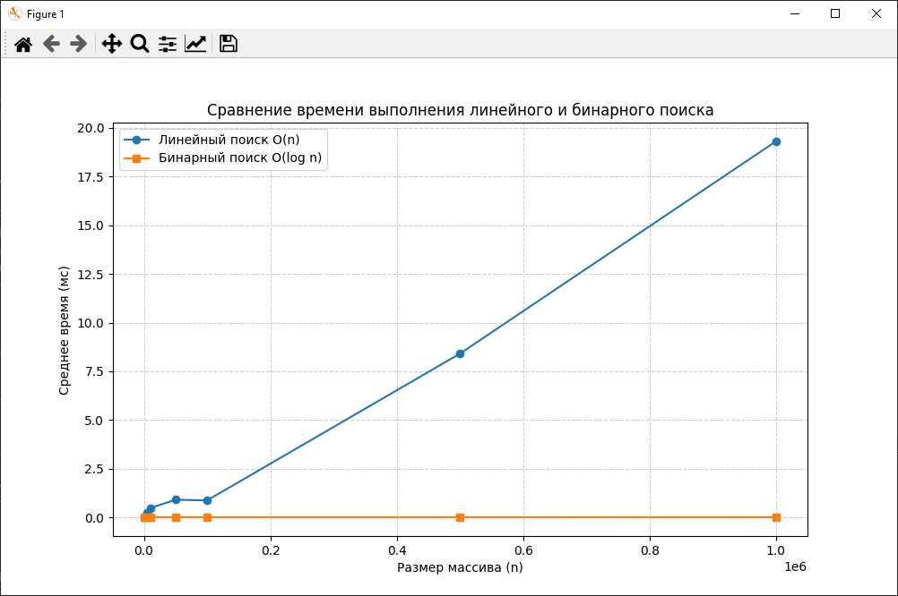
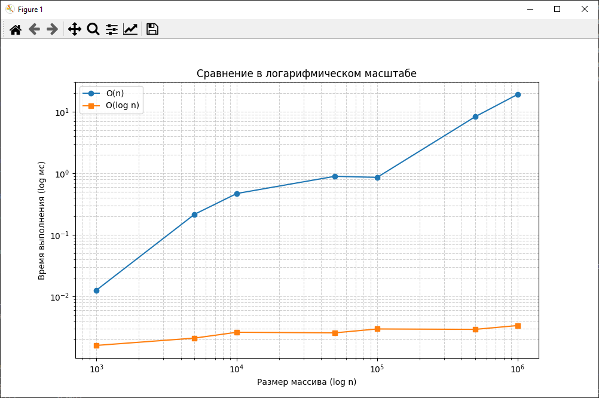

# Отчет по лабораторной работе №1
# Введение в алгоритмы. Сложность. Поиск

**Дата:** 2025-10-19  
**Семестр:** 3 курс, 1 полугодие (5 семестр)  
**Группа:** ПИЖ-б-о-23-1  
**Дисциплина:** Алгоритмы и структуры данных  
**Студент:** Борсов Беслан Мухамедович  

---

## Цель работы
Освоить понятие вычислительной сложности алгоритма, научиться реализовывать и анализировать алгоритмы линейного и бинарного поиска.  
Экспериментально подтвердить теоретические оценки сложности **O(n)** и **O(log n)**, визуализировать результаты и провести их анализ.

---

## Теоретическая часть

**Сложность алгоритма** — это характеристика, показывающая, сколько ресурсов (времени и памяти) требуется алгоритму для обработки входных данных объема *n*.

**Асимптотический анализ** позволяет оценивать поведение алгоритма при больших значениях *n* и не зависеть от аппаратных особенностей.

**O-нотация (Big O)** — верхняя асимптотическая граница роста времени выполнения.  
Используется для описания наихудшего сценария.

- **Линейный поиск (Linear Search)** — последовательный перебор всех элементов массива.  
  Сложность: **O(n)**.
- **Бинарный поиск (Binary Search)** — поиск в отсортированном массиве методом деления пополам.  
  Сложность: **O(log n)**. Требует предварительной сортировки массива.

---

## Практическая часть

### Выполненные задачи
- [x] Реализована функция `linear_search(arr, target)` с комментариями сложности.  
- [x] Реализована функция `binary_search(arr, target)` с комментариями сложности.  
- [x] Подготовлены массивы разных размеров для тестирования.  
- [x] Измерено среднее время выполнения каждого алгоритма.  
- [x] Построены графики зависимости времени от размера массива (линейный и логарифмический масштабы).  

---

### Ключевые фрагменты кода
```python
def linear_search(arr, target):
    for i in range(len(arr)):     # O(n)
        if arr[i] == target:      # O(1)
            return i
    return -1                     # O(1)
    # Общая сложность: O(n)


def binary_search(arr, target):
    left, right = 0, len(arr) - 1  # O(1)
    while left <= right:           # O(log n)
        mid = (left + right) // 2  # O(1)
        if arr[mid] == target:     # O(1)
            return mid
        elif arr[mid] < target:    # O(1)
            left = mid + 1
        else:
            right = mid - 1
    return -1                      # O(1)
    # Общая сложность: O(log n)
```markdown

## Результаты выполнения
```
Характеристики ПК для тестирования:
- Процессор: Intel Core i5-4460 @ 3.20GHz
- ОЗУ: 8 GB DDR3
- ОС: Windows 10
- Python: 3.13.5

    Размер Линейный поиск (мс) Бинарный поиск (мс)
---------------------------------------------
      1000          0.0337          0.0019
      5000          0.1616          0.0019
     10000          0.3540          0.0022
     50000          1.9937          0.0029
    100000          2.3803          0.0016
    500000          8.7683          0.0029
   1000000         45.9990          0.0032

```markdown

## Анализ результатов
   
1. Линейный поиск демонстрирует рост времени ~O(n) — при увеличении размера массива в 10 раз, время выполнения увеличивается примерно во столько же раз.
2. Бинарный поиск показывает логарифмический рост — увеличение размера массива почти не влияет на время.
3. Небольшие отклонения возможны из-за системных факторов и случайного выбора целевого элемента.
4. Эксперимент подтверждает теоретические оценки O(n) и O(log n).


## Ответы на контрольные вопросы
1. Что такое асимптотическая сложность алгоритма и зачем она нужна?
Это характеристика роста времени выполнения алгоритма при увеличении размера входных данных.
Позволяет оценить эффективность алгоритмов и сравнивать их независимо от конкретного компьютера.

2. Объясните разницу между O(1), O(n) и O(log n). Приведите примеры алгоритмов.

O(1) — постоянное время (например, доступ к элементу списка по индексу).

O(n) — линейное время (например, линейный поиск).

O(log n) — логарифмическое время (например, бинарный поиск в отсортированном массиве).

3. В чем основное отличие линейного поиска от бинарного? Какие условия нужны для бинарного поиска?
Линейный поиск перебирает все элементы подряд, а бинарный делит диапазон пополам.
Для бинарного поиска массив должен быть предварительно отсортирован.

4. Почему на практике время выполнения алгоритма может отличаться от теоретической оценки O-большое?
Из-за влияния аппаратуры, кешей, интерпретатора Python, фоновых процессов и случайных факторов времени измерения.

5. Как экспериментально подтвердить, что сложность алгоритма равна O(n) или O(log n)?

Реализовать алгоритмы.

Запустить их на массивах разного размера.

Измерить среднее время выполнения.

Построить график зависимости времени от размера массива и сравнить с теоретической функцией.

## Приложения

**График 1:** зависимости времени выполнения от размера массива  


**График 2:** логарифмическая шкала (подтверждение O(log n))  
