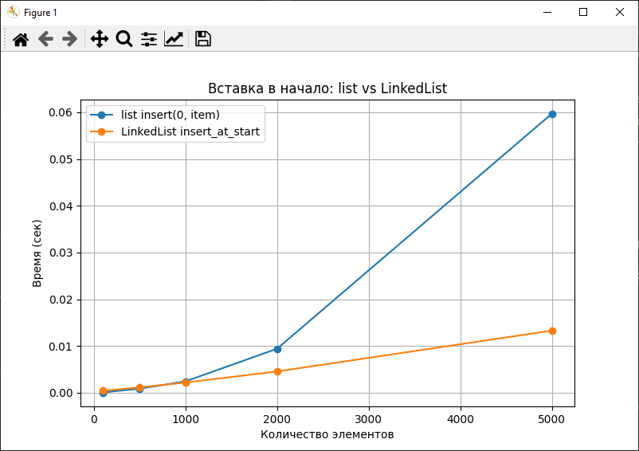
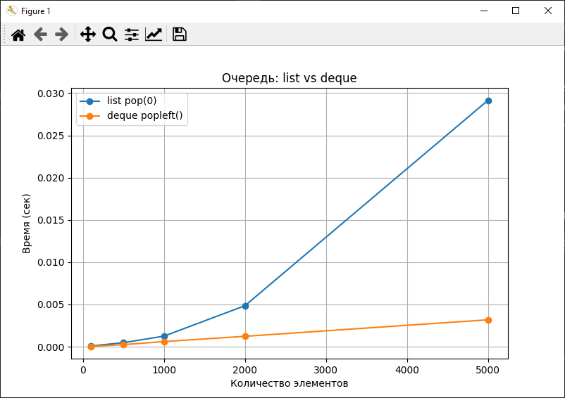

# Отчет по лабораторной работе №2
# Тема 02: Основные структуры данных. Анализ и применение

**Дата:** 2025-10-19  
**Семестр:** 3 курс, 1 полугодие (5 семестр)  
**Группа:** ПИЖ-б-о-23-1  
**Дисциплина:** Алгоритмы и структуры данных  
**Студент:** Борсов Беслан Мухамедович  

---

### Цель работы
Изучить понятие и особенности базовых абстрактных типов данных (стек, очередь, дек, связный список) и их реализаций в Python. 
Научиться выбирать оптимальную структуру данных для решения конкретной задачи, основываясь на анализе теоретической и практической сложности операций. 
Получить навыки измерения производительности и применения структур данных для решения практических задач.

---

## Теоретическая часть


- **Список (list) в Python:** Реализация динамического массива. Обеспечивает амортизированное
время O(1) для добавления в конец (append). Вставка и удаление в середину имеют сложность
O(n) из-за сдвига элементов. Доступ по индексу - O(1).
- **Связный список (Linked List):** Абстрактная структура данных, состоящая из узлов, где каждый
узел содержит данные и ссылку на следующий элемент. Вставка и удаление в известное место
(например, начало списка) выполняются за O(1). Доступ по индексу и поиск - O(n).
- **Стек (Stack):** Абстрактный тип данных, работающий по принципу LIFO (Last-In-First-Out).
Основные операции: push (добавление, O(1)), pop (удаление с вершины, O(1)), peek (просмотр
вершины, O(1)). В Python может быть реализован на основе списка.
- **Очередь (Queue):** Абстрактный тип данных, работающий по принципу FIFO (First-In-First-Out).
Основные операции: enqueue (добавление в конец, O(1)), dequeue (удаление из начала, O(1)). В
Python для эффективной реализации используется collections.deque.
- **Дек (Deque, двусторонняя очередь):** Абстрактный тип данных, позволяющий добавлять и
удалять элементы как в начало, так и в конец. Все основные операции - O(1). В Python реализован
в классе collections.deque.

---

## Практическая часть

### Выполненные задачи
1. Реализован класс `LinkedList` с методами:
   - `insert_at_start` — вставка в начало списка (O(1))
   - `insert_at_end` — вставка в конец списка (O(1))
   - `delete_from_start` — удаление из начала списка (O(1))
   - `traversal` — обход списка (O(n))

2. Проведен анализ производительности встроенных структур:
   - Сравнение `list` и `LinkedList` для вставки в начало.
   - Сравнение `list` и `deque` для операций очереди (удаление из начала).

3. Решены практические задачи:
   - Проверка сбалансированности скобок (`Stack` на основе `list`).
   - Симуляция очереди печати (`Queue` на основе `deque`).
   - Проверка палиндрома (`Deque` на основе `collections.deque`).

---

### Ключевые фрагменты кода
```python
# Пример реализации вставки в начало LinkedList
def insert_at_start(self, data):
    new_node = Node(data)
    new_node.next = self.head
    self.head = new_node
    if self.tail is None:
        self.tail = new_node
    # O(1)


# Проверка сбалансированности скобок
def is_balanced(expr):
    stack = []
    pairs = {'(': ')', '[': ']', '{': '}'}
    for char in expr:
        if char in pairs:
            stack.append(char)
        elif char in pairs.values():
            if not stack or pairs[stack.pop()] != char:
                return False
    return not stack
```

## Результаты выполнения
```
Характеристики ПК для тестирования:

Процессор: Intel Core i5-4460 @ 3.20GHz

ОЗУ: 8 GB DDR3

ОС: Windows 10

Python: 3.13.5

Вставка в начало:
100 элементов -> list: 0.000081, LinkedList: 0.000213
500 элементов -> list: 0.000800, LinkedList: 0.001180
1000 элементов -> list: 0.003033, LinkedList: 0.002246
2000 элементов -> list: 0.008732, LinkedList: 0.005090
5000 элементов -> list: 0.052237, LinkedList: 0.011503

Очередь (удаление из начала):
100 элементов -> list pop(0): 0.000127, deque popleft(): 0.000045
500 элементов -> list pop(0): 0.000500, deque popleft(): 0.000235
1000 элементов -> list pop(0): 0.001230, deque popleft(): 0.000577
2000 элементов -> list pop(0): 0.003995, deque popleft(): 0.001228
5000 элементов -> list pop(0): 0.029295, deque popleft(): 0.003116

```

## Анализ результатов


###  Вставка в начало

**Для списка `list`**  
Вставка в начало имеет сложность **O(n)** на каждую операцию, что в сумме даёт **O(n²)**.  
На графике видно **линейно-кубическое возрастание времени** при увеличении количества элементов.

**Для `LinkedList`**  
Вставка в начало выполняется за **O(1)** на операцию, что подтверждается **почти постоянным временем** на графике.

---

### Очередь

**Для списка `list.pop(0)`**  
Операция удаления первого элемента имеет сложность **O(n)**,  
что значительно увеличивает время выполнения при росте числа элементов.

**Для `deque.popleft()`**  
Операция выполняется за **O(1)**,  
и время растёт **почти линейно** с увеличением количества элементов.

---

###  Вывод

- `LinkedList` эффективен для частых вставок и удалений **в начале структуры**.  
- `deque` предпочтителен для **реализации очередей**.  
- `list` удобен для **доступа по индексу** и **вставки в конец**.


## Ответы на контрольные вопросы

### 1 В чем ключевое отличие динамического массива (`list` в Python) от связного списка с точки зрения сложности операций вставки в начало и доступа по индексу?

**Динамический массив (`list`)** хранит элементы **в непрерывном участке памяти**.  
Поэтому доступ к элементу по индексу выполняется за **O(1)** (прямой адресный доступ).  
Однако **вставка в начало** требует **сдвига всех элементов вправо**, что даёт сложность **O(n)**.  

**Связный список (`LinkedList`)**, напротив, хранит элементы как **узлы, связанные указателями**.  
Вставка в начало — это просто создание нового узла и изменение ссылки на первый элемент, что выполняется за **O(1)**.  
Зато **доступ по индексу** требует последовательного прохода от начала списка — **O(n)**.

---

### 2 Объясните принцип работы стека (LIFO) и очереди (FIFO). Приведите по два примера их практического использования.

**Стек (LIFO — Last In, First Out)**  
Последним добавленный элемент извлекается первым.  
Принцип «последним вошёл — первым вышел».  
**Примеры использования:**
- Реализация **операции “Отменить действие” (Undo)** в редакторах.  
- Хранение **вызовов функций** (стек вызовов) в программах.

**Очередь (FIFO — First In, First Out)**  
Первым добавленный элемент извлекается первым.  
Принцип «первым вошёл — первым вышел».  
**Примеры использования:**
- **Обработка задач в очереди печати.**  
- **Планирование процессов** в операционной системе.

---

### 3 Почему операция удаления первого элемента из списка (`list`) в Python имеет сложность O(n), а из дека (`deque`) — O(1)?

В списке (`list`) элементы хранятся **в непрерывной памяти**.  
При удалении первого элемента происходит **сдвиг всех оставшихся элементов** влево,  
поэтому операция имеет сложность **O(n)**.  

В `deque` (двусторонней очереди) элементы организованы как **кольцевая буферная структура**,  
и удаление первого элемента — это просто **изменение указателя на начало**,  
что выполняется за **O(1)**.

---

### 4 Какую структуру данных вы бы выбрали для реализации системы отмены действий (Undo) в текстовом редакторе? Обоснуйте свой выбор.

Для реализации **системы Undo** логично использовать **стек (LIFO)**.  
Последнее выполненное действие должно быть **отменено первым**,  
что идеально соответствует принципу работы стека.  

Каждое действие (вставка, удаление, замена текста) помещается в стек,  
а при нажатии «Отменить» оно извлекается и выполняется обратная операция.

---

### 5 Замеры показали, что вставка 1000 элементов в начало списка заняла значительно больше времени, чем вставка в начало вашей реализации связного списка. Объясните результаты с точки зрения асимптотической сложности.

У списка (`list`) вставка в начало имеет сложность **O(n)**,  
так как требуется **сдвиг всех элементов** после каждой вставки.  
Вставка 1000 элементов выполняется примерно за **O(n²)** операций.  

У связного списка (`LinkedList`) вставка в начало выполняется за **O(1)** —  
создаётся новый узел, и он становится головой списка.  
Таким образом, вставка 1000 элементов имеет общую сложность **O(n)**,  
что объясняет значительно меньшее время выполнения.

---


## Приложения

**График 1:**  Вставка в начало: list vs LinkedList


**График 2:** Очередь: list vs deque
