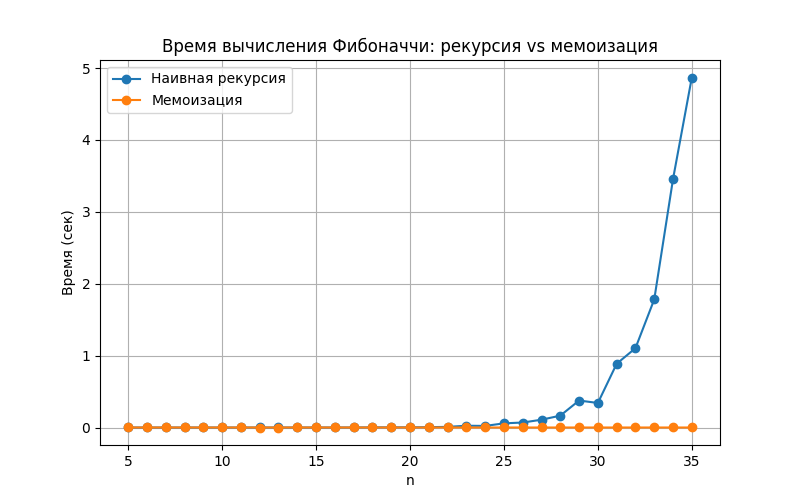

# Отчет по лабораторной работе №3
# Тема 03: Рекурсия

**Семестр:** 3 курс, 1 полугодие (5 семестр)  
**Группа:** ПИЖ-б-о-23-1  
**Дисциплина:** Алгоритмы и структуры данных  
**Студент:** Борсов Беслан Мухамедович  

---

### Цель работы
Освоить принцип рекурсии, научиться анализировать рекурсивные алгоритмы и
понимать механизм работы стека вызовов. Изучить типичные задачи, решаемые рекурсивно, и освоить
технику мемоизации для оптимизации рекурсивных алгоритмов. Получить практические навыки
реализации и отладки рекурсивных функций.


---

## Теоретическая часть


- **Рекурсия:** Процесс, при котором функция прямо или косвенно вызывает саму себя для решения задачи..
- **Базовый случай (условие выхода):** Обязательное условие, которое прекращает рекурсивные
вызовы и предотвращает зацикливание
узел содержит данные и ссылку на следующий элемент. Вставка и удаление в известное место
(например, начало списка) выполняются за O(1). Доступ по индексу и поиск - O(n).
- **Рекурсивный шаг:** Шаг, на котором задача разбивается на более простую подзадачу того же
типа и производится рекурсивный вызов.
- **Глубина рекурсии:** Количество вложенных вызовов функции. Ограничена размером стека
вызовов.
Основные операции: enqueue (добавление в конец, O(1)), dequeue (удаление из начала, O(1)). В
Python для эффективной реализации используется collections.deque.
- **Мемоизация (Memoization)** Техника оптимизации, позволяющая избежать повторных
вычислений результатов функций для одних и тех же входных данных путем сохранения ранее
вычисленных результатов в кеше (например, в словаре).

---

# Практическая часть

## Выполненные задачи

1. **Реализованы базовые рекурсивные алгоритмы:**
   - `factorial(n)` — вычисление факториала (O(n), глубина рекурсии O(n))
   - `fibonacci(n)` — наивное рекурсивное вычисление чисел Фибоначчи (O(2^n))
   - `fast_power(a, n)` — быстрое возведение в степень (O(log n))

2. **Оптимизация рекурсивных функций:**
   - реализована мемоизированная версия `fibonacci_memo(n)`  
     (O(n), глубина рекурсии O(n))
   - сравнение количества вызовов и времени работы наивной и оптимизированной реализаций

3. **Решены практические задачи с использованием рекурсии:**
   - рекурсивный бинарный поиск (O(log n))
   - рекурсивный обход файловой системы (O(N))
   - решение задачи «Ханойские башни» (O(2^n))

4. **Выполнено экспериментальное исследование:**
   - построен график времени вычисления чисел Фибоначчи  
   - измерена глубина рекурсии в различных задачах

---

### Ключевые фрагменты кода
```python
# Наивный рекурсивный Фибоначчи
def fibonacci(n):
    if n <= 1:                # O(1)
        return n
    return fibonacci(n-1) + fibonacci(n-2)  # два рекурсивных вызова
    # Итоговая сложность: O(2^n)


# Фибоначчи с мемоизацией
memo = {}

def fibonacci_memo(n):
    if n in memo:             # O(1)
        return memo[n]
    if n <= 1:                # O(1)
        memo[n] = n           # O(1)
    else:
        memo[n] = fibonacci_memo(n-1) + fibonacci_memo(n-2)  # O(1)
    return memo[n]
    # Итоговая сложность: O(n)

# Быстрое возведение в степень (fast power)
def fast_power(a, n):
    if n == 0:                # O(1)
        return 1
    if n % 2 == 0:            # O(1)
        half = fast_power(a, n // 2)  # O(log n)
        return half * half
    else:
        return a * fast_power(a, n-1) # O(log n)
    # Итоговая сложность: O(log n)

# Рекурсивный бинарный поиск
def binary_search(arr, target, left, right):
    if left > right:          # O(1)
        return -1
    mid = (left + right) // 2 # O(1)

    if arr[mid] == target:    # O(1)
        return mid
    elif arr[mid] > target:
        return binary_search(arr, target, left, mid - 1)  # O(log n)
    else:
        return binary_search(arr, target, mid + 1, right) # O(log n)

```

## Характеристики ПК для тестирования
```
Процессор: Intel Core i5-4460 @ 3.20GHz

ОЗУ: 8 GB DDR3

ОС: Windows 10

Python: 3.13.5

```

## Анализ результатов


1. Фибоначчи: наивная рекурсия vs мемоизация
Наивная версия
экспоненциальный рост вызовов: ≈ 2^n
при n = 35 выполняет миллионы вызовов график показывает резкий рост времени

Мемоизация
каждая функция вычисляется один раз
время растет почти линейно
ускорение — в десятки тысяч раз

2. Fast Power

глубина рекурсии логарифмическая
даже огромные степени вычисляются без задержек
показывает, что рекурсия может быть оптимальной

3. Бинарный поиск

глубина рекурсии ≈ log₂(n)
для массива 1 000 000 элементов — около 20 уровней
подтверждает теоретическую сложность O(log n)

4. Рекурсивный обход файловой системы

время зависит от количества файлов (O(N))
глубина рекурсии = глубина вложения каталогов
обычно 10–40 уровней

5. Ханойские башни

экспоненциальная сложность O(2^n)
n=10 → 1023 шага
n=20 → более 1 000 000 шагов
используется только для обучения рекурсии

---


###  Вывод

Рекурсия удобна, когда задача имеет древовидную структуру (деревья, каталоги, бинарный поиск, fast power).

Наивная рекурсия неэффективна, когда выполняются повторные вычисления (как в Fibonacci), но мемоизация полностью решает проблему.

Fast power показывает, что рекурсивный алгоритм может быть наиболее эффективным возможным решением.

Экспоненциальные алгоритмы (Ханойские башни) подходят только для обучения или небольших входных данных.


## Приложения

**График:**  Время вычисления Фибоначчи: рекурсия vs мемоизация

