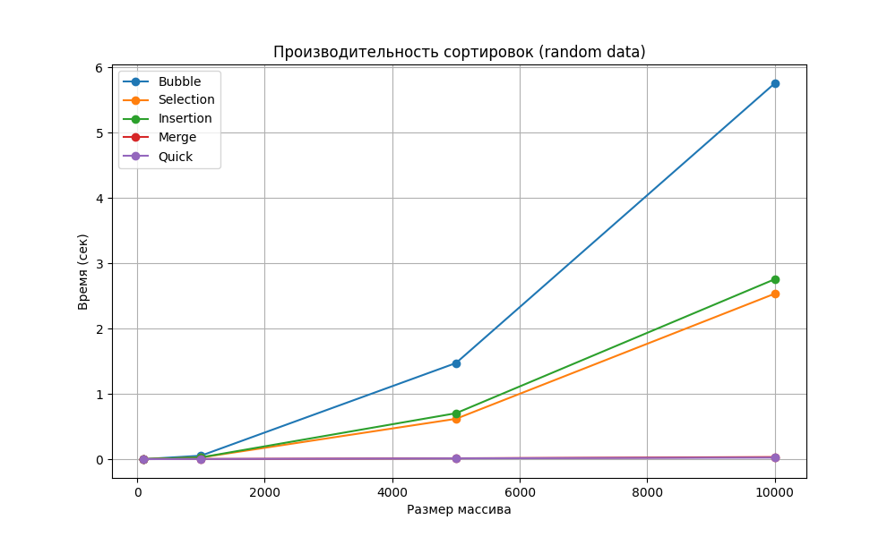
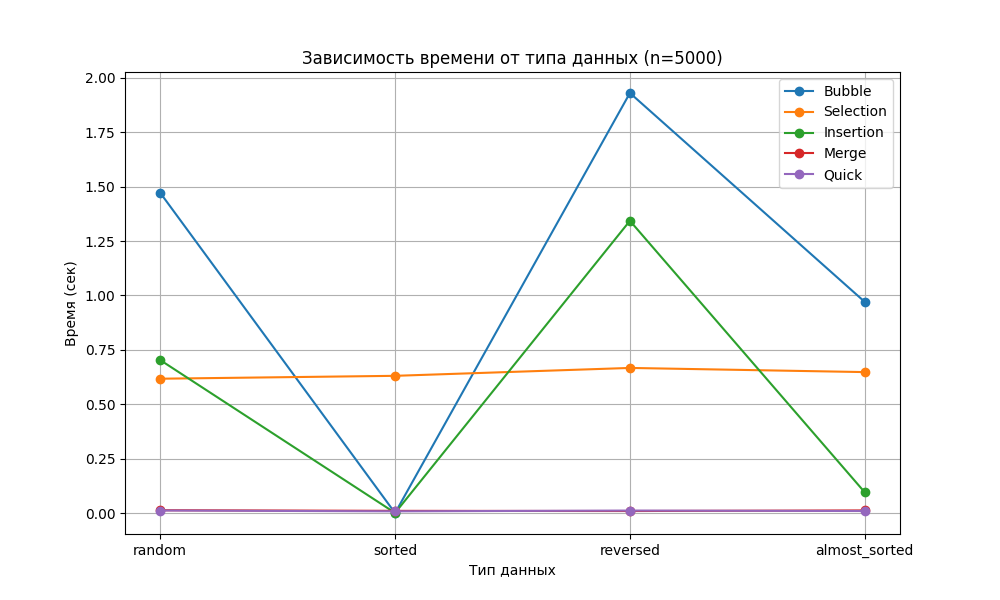

# Отчет по лабораторной работе №4
# Тема 04: Алгоритмы сортировки

**Семестр:** 3 курс, 1 полугодие (5 семестр)  
**Группа:** ПИЖ-б-о-23-1  
**Дисциплина:** Алгоритмы и структуры данных  
**Студент:** Борсов Беслан Мухамедович  

---

### Цель работы
Изучить и реализовать основные алгоритмы сортировки. Провести их теоретический и
практический сравнительный анализ по временной и пространственной сложности. Исследовать
влияние начальной упорядоченности данных на эффективность алгоритмов. Получить навыки
эмпирического анализа производительности алгоритмов.


---

## Теоретическая часть


- **Сортировка пузырьком (Bubble Sort):** Многократно проходит по массиву, сравнивая и меняя
местами соседние элементы. Сложность: O(n²) во всех случаях.
- **Сортировка выбором (Selection Sort):**  На каждом проходе находит минимальный элемент из
неотсортированной части и ставит его на очередную позицию. Сложность: O(n²).
- **Сортировка вставками (Insertion Sort):** Ш Построение окончательного массива путем пошагового вставления каждого элемента в правильную позицию в уже отсортированной части. Сложность: O(n²) в худшем и среднем, O(n) в лучшем (уже отсортированный массив)
- **Сортировка слиянием (Merge Sort):** Рекурсивный алгоритм "разделяй и властвуй". Массив
разбивается на две части, которые сортируются рекурсивно, а затем сливаются в один
отсортированный массив. Сложность: O(n log n) во всех случаях. Требует O(n) дополнительной
памяти. Основные операции: enqueue (добавление в конец, O(1)), dequeue (удаление из начала, O(1)). В Python для эффективной реализации используется collections.deque.
- **Быстрая сортировка (Quick Sort)** Рекурсивный алгоритм "разделяй и властвуй". Выбирается
опорный элемент, массив разделяется на элементы меньше и больше опорного, которые сортируются рекурсивно. Сложность: O(n log n) в среднем, O(n²) в худшем случае (плохой выбор опорного элемента). Сортировка на месте, не требует дополнительной памяти.

---

# Практическая часть

## Выполненные задачи

. **Реализованы классические алгоритмы сортировки:**
   - `bubble_sort` — сортировка пузырьком  
     Лучший случай: **O(n)**, худший: **O(n²)**, память: **O(1)**
   - `selection_sort` — сортировка выбором  
     Все случаи: **O(n²)**, память: **O(1)**
   - `insertion_sort` — сортировка вставками  
     Лучший случай: **O(n)**, худший: **O(n²)**, память: **O(1)**
   - `merge_sort` — сортировка слиянием  
     Все случаи: **O(n log n)**, память: **O(n)**
   - `quick_sort` — быстрая сортировка  
     Средний случай: **O(n log n)**, худший: **O(n²)**, память: **O(log n)**

2. **Добавлены комментарии со сложностью на каждой ключевой операции.**

3. **Проведено экспериментальное сравнение алгоритмов:**
   - Измерено время работы на массивах разных размеров
   - Построены графики роста времени
   - Сравнены лучшие/худшие случаи для каждого алгоритма
---

### Ключевые фрагменты кода
```python
def bubble_sort(arr):
    """
    Сортировка пузырьком
    Лучший случай:    O(n)        — массив уже отсортирован
    Худший случай:    O(n^2)
    Память: O(1)
    """
    a = arr[:]       # O(n) — копирование массива
    n = len(a)       # O(1)

    for i in range(n):                 # O(n)
        swapped = False                # O(1)
        for j in range(0, n - i - 1):  # O(n)
            if a[j] > a[j + 1]:        # O(1)
                a[j], a[j + 1] = a[j + 1], a[j]  # O(1)
                swapped = True
        if not swapped:                # O(1)
            break
    return a
    # Итоговая сложность: O(n^2)


def selection_sort(arr):
    """
    Сортировка выбором
    Лучший случай:    O(n^2)
    Худший случай:    O(n^2)
    Память: O(1)
    """
    a = arr[:]       # O(n)
    n = len(a)       # O(1)

    for i in range(n):                 # O(n)
        min_index = i                  # O(1)
        for j in range(i + 1, n):      # O(n)
            if a[j] < a[min_index]:    # O(1)
                min_index = j          # O(1)
        a[i], a[min_index] = a[min_index], a[i]  # O(1)
    return a
    # Итоговая сложность: O(n^2)

def insertion_sort(arr):
    """
    Сортировка вставками
    Лучший случай:    O(n)      — массив уже отсортирован
    Худший случай:    O(n^2)
    Память: O(1)
    """
    a = arr[:]          # O(n)

    for i in range(1, len(a)):     # O(n)
        key = a[i]                 # O(1)
        j = i - 1                  # O(1)

        while j >= 0 and a[j] > key:  # O(n)
            a[j + 1] = a[j]        # O(1)
            j -= 1                 # O(1)

        a[j + 1] = key             # O(1)

    return a
    # Итоговая сложность: O(n^2)

def merge_sort(arr):
    """
    Сортировка слиянием
    Лучший случай:    O(n log n)
    Худший случай:    O(n log n)
    Память: O(n)
    """
    if len(arr) <= 1:  # O(1)
        return arr

    mid = len(arr) // 2               # O(1)
    left = merge_sort(arr[:mid])      # O(n/2 log n)
    right = merge_sort(arr[mid:])     # O(n/2 log n)

    return merge(left, right)         # O(n)
    # Итоговая сложность: O(n log n)

```

## Характеристики ПК для тестирования
```
Процессор: Intel Core i5-4460 @ 3.20GHz

ОЗУ: 8 GB DDR3

ОС: Windows 10

Python: 3.13.5

```

## Анализ результатов


### **Простые сортировки (O(n²))**
- **Bubble Sort** — самый медленный, чувствителен к порядку данных.  
- **Selection Sort** — предсказуемый, всегда делает одинаковое число сравнений.  
- **Insertion Sort** — лучший среди простых, особенно на *почти отсортированных* данных.

### **Быстрые сортировки (O(n log n))**
- **Merge Sort** — стабилен, всегда O(n log n), но требует дополнительную память.  
- **Quick Sort** — самый быстрый на практике, in-place; худший случай только на плохом выборе опорного.
---

Ниже приведены усреднённые времена работы (сек).

---

##  **Тип данных: random**

| Размер | Bubble | Selection | Insertion | Merge | Quick |
|-------|--------|-----------|-----------|-------|-------|
| 100   | 0.0004 | 0.0003 | 0.0003 | 0.0002 | 0.0002 |
| 1000  | 0.0530 | 0.0256 | 0.0269 | 0.0026 | 0.0023 |
| 5000  | 1.4716 | 0.6174 | 0.7031 | 0.0132 | 0.0119 |
| 10000 | 5.7552 | 2.5335 | 2.7550 | 0.0322 | 0.0232 |

**Вывод:** Merge и Quick быстрее квадратичных сортировок **в 50–200 раз**.

---

##  **Тип данных: sorted**

| Размер | Bubble | Selection | Insertion | Merge | Quick |
|-------|--------|-----------|-----------|-------|-------|
| 100   | 0.0000 | 0.0003 | 0.0000 | 0.0001 | 0.0001 |
| 1000  | 0.0001 | 0.0254 | 0.0001 | 0.0021 | 0.0012 |
| 5000  | 0.0004 | 0.6307 | 0.0007 | 0.0103 | 0.0081 |
| 10000 | 0.0007 | 2.5187 | 0.0016 | 0.0197 | 0.0155 |

**Вывод:**  
- Bubble и Insertion → **переходят к O(n)** (идеальные условия).  
- Selection остаётся O(n²) в любом случае.  
- Merge/Quick стабильно быстрые.

---

##  **Тип данных: reversed**

| Размер | Bubble | Selection | Insertion | Merge | Quick |
|-------|--------|-----------|-----------|-------|-------|
| 100   | 0.0005 | 0.0002 | 0.0004 | 0.0001 | 0.0001 |
| 1000  | 0.0695 | 0.0272 | 0.0520 | 0.0015 | 0.0011 |
| 5000  | 1.9302 | 0.6669 | 1.3431 | 0.0094 | 0.0116 |
| 10000 | 7.6123 | 2.6881 | 5.6772 | 0.0211 | 0.0184 |

**Вывод:**  
- Bubble и Insertion сильно замедляются.  
- Merge не чувствителен к входу.  
- Quick работает стабильно, худший случай не проявился (хороший выбор pivot).

---

##  **Тип данных: almost_sorted**

| Размер | Bubble | Selection | Insertion | Merge | Quick |
|-------|--------|-----------|-----------|-------|-------|
| 100   | 0.0002 | 0.0002 | 0.0000 | 0.0001 | 0.0001 |
| 1000  | 0.0364 | 0.0262 | 0.0032 | 0.0033 | 0.0014 |
| 5000  | 0.9704 | 0.6478 | 0.0953 | 0.0122 | 0.0095 |
| 10000 | 3.7426 | 2.6149 | 0.3699 | 0.0275 | 0.0166 |

**Вывод:**  
- Insertion Sort показывает **лучшее время среди простых сортировок** — почти линейное.  
- Quick снова стабильно самый быстрый.

---

###  Вывод

- **Quick Sort** — лучший выбор для большинства случаев.  
- **Merge Sort** — лучший выбор когда нужна стабильность.  
- **Insertion Sort** — эффективен для маленьких и почти упорядоченных массивов.  
- **Bubble и Selection** — учебные алгоритмы, не подходят для больших данных.ы


## Приложения

**График 1:**  Производительность сортировок


**График 2:**  Зависимость времени от типа данных

