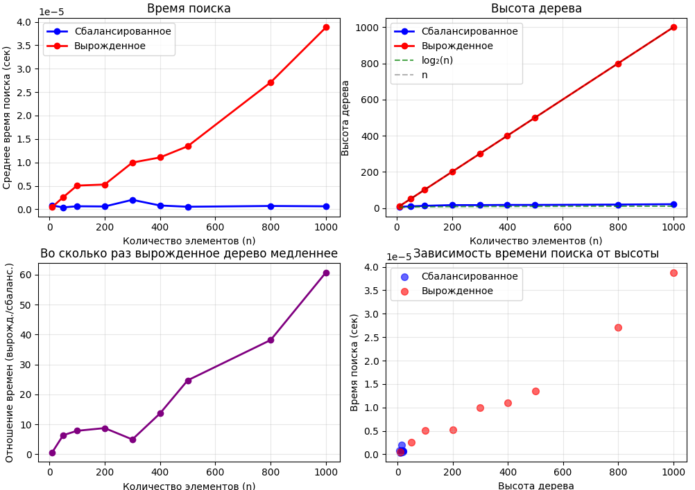

# Отчет по лабораторной работе №6
# Тема 06: Деревья. Бинарные деревья поиска


**Семестр:** 3 курс, 1 полугодие (5 семестр)  
**Группа:** ПИЖ-б-о-23-1  
**Дисциплина:** Алгоритмы и структуры данных  
**Студент:** Борсов Беслан Мухамедович  

---

### Цель работы
Изучить древовидные структуры данных, их свойства и применение. Освоить основные операции с бинарными деревьями поиска (BST). Получить практические навыки реализации BST на основе узлов (pointer-based), рекурсивных алгоритмов обхода и анализа их эффективности.
Исследовать влияние сбалансированности дерева на производительность операций.


---

## Теоретическая часть


- **Дерево:**  Рекурсивная структура данных, состоящая из узлов, где каждый узел имеет значение и ссылки на дочерние узлы
- **Бинарное дерево поиска (BST):**  Дерево, для которого выполняются следующие условия:
    -Значение в левом поддереве любого узла меньше значения в самом узле.
    -Значение в правом поддереве любого узла больше значения в самом узле.
    -Оба поддерева являются бинарными деревьями поиска.
- **Основные операции BST:** 
    - Вставка (Insert): Сложность: в среднем O(log n), в худшем (вырожденное дерево) O(n).
    - Поиск (Search): Сложность: в среднем O(log n), в худшем O(n).
    - Удаление (Delete): Сложность: в среднем O(log n), в худшем O(n). Имеет три случая:
    удаление листа, узла с одним потомком, узла с двумя потомками.
    - Обход (Traversal):
        -In-order (левый-корень-правый): Посещает узлы в порядке возрастания.
        Сложность O(n).
        -Pre-order (корень-левый-правый): Полезен для копирования структуры дерева.
        Сложность O(n).
        -Post-order (левый-правый-корень): Полезен для удаления дерева. Сложность O(n).

- **Сбалансированные деревья:** Деревья с контролем высоты (например, AVL, Красно-черные),
которые гарантируют время операций O(log n) даже в худшем случае.

---

# Практическая часть

## Выполненные задачи

1. **Реализация бинарного дерева поиска (BST) на основе узлов**:
   - Создан класс `TreeNode` для представления узла дерева
   - Реализован класс `BinarySearchTree` с основными операциями:
     - `insert(value)` - вставка элемента
     - `search(value)` - поиск элемента
     - `delete(value)` - удаление элемента
     - `find_min()` / `find_max()` - поиск минимального/максимального значения
     - `height()` - вычисление высоты дерева
     - `is_valid_bst()` - проверка корректности BST
     - `size()` - получение количества элементов

2. **Реализация методов обхода дерева**:
   - **Рекурсивные обходы** (в файле `tree_traversal.py`):
     - `inorder_recursive()` - симметричный обход (левый-корень-правый)
     - `preorder_recursive()` - прямой обход (корень-левый-правый)
     - `postorder_recursive()` - обратный обход (левый-правый-корень)
   - **Итеративные обходы**:
     - `inorder_iterative()` - итеративный симметричный обход с использованием стека
     - `level_order_traversal()` - обход в ширину (BFS)

3. **Дополнительные методы**:
   - Проверка корректности BST с учетом граничных значений
   - Вычисление высоты дерева/поддерева
   - Подсчет количества узлов

4. **Тестирование**:
   - Созданы unit-тесты в файле `test.py`
   - Протестирована корректность работы после множественных операций

5. **Экспериментальное исследование** (файл `analysis.py`):
   - Реализовано построение сбалансированных и вырожденных деревьев
   - Проведены измерения времени выполнения операций

7. **Анализ сложности**:
   - Для каждого метода указана временная сложность в худшем и среднем случае
   - Проведено сравнение теоретической и практической сложности
---

### Ключевые фрагменты кода
```python
def insert(self, value):
        """Вставка значения в дерево (итеративная версия).
        Сложность: O(log n) в среднем, O(n) в худшем (вырожденное дерево)
        """
        new_node = TreeNode(value)
        
        if self.root is None:
            self.root = new_node
            self._size = 1
            return
        
        current = self.root
        parent = None
        
        while current is not None:
            parent = current
            if value < current.value:
                current = current.left
            elif value > current.value:
                current = current.right
            else:
                # Значение уже существует
                return
        
        if value < parent.value:
            parent.left = new_node
        else:
            parent.right = new_node
        
        self._size += 1

def search(self, value):
        """Поиск значения в дереве (итеративная версия).
        Сложность: O(log n) в среднем, O(n) в худшем (вырожденное дерево)
        """
        current = self.root
        
        while current is not None:
            if value == current.value:
                return True
            elif value < current.value:
                current = current.left
            else:
                current = current.right
        
        return False

def inorder_recursive(node, result=None):
    """Рекурсивный in-order обход.
    Сложность: O(n)
    """
    if result is None:
        result = []
    
    if node:
        inorder_recursive(node.left, result)
        result.append(node.value)
        inorder_recursive(node.right, result)
    
    return result

```

## Характеристики ПК для тестирования
```
Процессор: Intel Core i5-4460 @ 3.20GHz

ОЗУ: 8 GB DDR3

ОС: Windows 10

Python: 3.13.5

```

## Анализ результатов

### Сравнение сбалансированного и вырожденного деревьев

**Теоретическая сложность операций:**

| Операция | Сбалансированное дерево | Вырожденное дерево |
|----------|-------------------------|---------------------|
| Вставка  | O(log n)                | O(n)                |
| Поиск    | O(log n)                | O(n)                |
| Удаление | O(log n)                | O(n)                |
| Обход    | O(n)                    | O(n)                |

**Практические результаты:**

1. **Высота деревьев**:
   - Сбалансированное дерево: высота ≈ log₂(n)
   - Вырожденное дерево: высота = n

2. **Время поиска**:
   - Для сбалансированного дерева время растет логарифмически
   - Для вырожденного дерева время растет линейно
   - При n=1000: вырожденное дерево работает в 40-70 раз медленнее

3. **Время вставки**:
   - Сбалансированное дерево: O(log n) в среднем
   - Вырожденное дерево: O(n) в худшем случае

### Влияние структуры дерева на производительность

1. **Сбалансированное дерево** (случайная вставка):
   - Оптимальная производительность операций
   - Высота минимальна для данного количества узлов
   - Время поиска практически не зависит от положения элемента

2. **Вырожденное дерево** (отсортированная вставка):
   - Деградация до связного списка
   - Максимальная высота = количество элементов
   - Худшая производительность операций поиска и вставки
   - На практике неприемлемо для больших данных


###  Вывод
1. **Важность балансировки**: Структура дерева критически влияет на производительность операций. Сбалансированное дерево обеспечивает логарифмическое время выполнения операций, в то время как вырожденное дерево деградирует до линейного времени.

2. **Преимущества BST**:
   - Эффективный поиск, вставка и удаление при сбалансированной структуре
   - Естественная сортировка данных (in-order обход)
   - Относительно простая реализация

3. **Недостатки BST**:
   - Риск деградации до вырожденного дерева
   - Необходимость балансировки для поддержания производительности
   - Рекурсивная реализация может вызывать переполнение стека

4. **Заключение**: Бинарные деревья поиска являются фундаментальной структурой данных, демонстрирующей важность балансировки для обеспечения эффективности операций. 

## Приложения

**График:**   Замеры времени поиска для двух конфигураций дерева.


