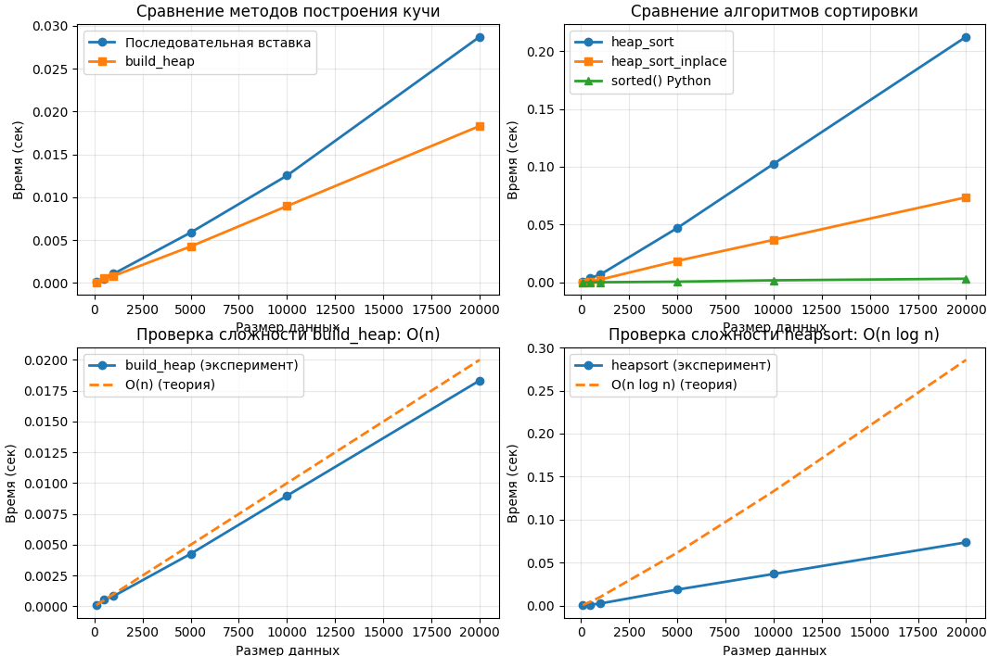

# Отчет по лабораторной работе №7
# Тема 07: Кучи (Heaps)

**Семестр:** 3 курс, 1 полугодие (5 семестр)  
**Группа:** ПИЖ-б-о-23-1  
**Дисциплина:** Алгоритмы и структуры данных  
**Студент:** Борсов Беслан Мухамедович  

---

### Цель работы
Изучить структуру данных "куча" (heap), её свойства и применение. Освоить основные
операции с кучей (добавление, извлечение корня) и алгоритм её построения. Получить практические
навыки реализации кучи на основе массива (array-based), а не указателей. Исследовать эффективность основных операций и применение кучи для сортировки и реализации приоритетной очереди


---

## Теоретическая часть


- **Куча (Heap):** Специализированная древовидная структура данных, удовлетворяющая свойству
кучи. Является полным бинарным деревом (все уровни заполнены, кроме последнего, который
заполняется слева направо).
- **Свойство кучи:**  
    -Min-Heap: Значение в любом узле меньше или равно значениям его потомков. Корень —
    минимальный элемент.
    -Max-Heap: Значение в любом узле больше или равно значениям его потомков. Корень —
    максимальный элемент.

- **Реализация:**  Куча эффективно реализуется на основе массива. Для узла с индексом i:
    -Индекс родителя: (i-1)//2
    -Индекс левого потомка: 2*i + 1
    -Индекс правого потомка: 2*i + 2
- **Основные операции:** 
    -Вставка (Insert): Элемент добавляется в конец массива и "всплывает" (sift-up) до
    восстановления свойства кучи. Сложность: O(log n).
    -Извлечение корня (Extract): Корень (элемент [0]) извлекается, последний элемент
    ставится на его место и "погружается" (sift-down) до восстановления свойства кучи.
    Сложность: O(log n).
    -Построение кучи (Heapify): Преобразование произвольного массива в кучу. Может быть
    выполнено алгоритмом со сложностью O(n).
- **Применение:** 
    -Сортировка кучей (Heapsort).
    -Реализация приоритетной очереди.
    -Алгоритм Дейкстры.


---

# Практическая часть

## Выполненные задачи
### 1. Реализация структуры данных "Куча" на основе массива
- **MinHeap**: Куча с минимальным элементом в корне
- **MaxHeap**: Куча с максимальным элементом в корне
- **Основные методы**:
  - `insert(value)`: Вставка элемента с восстановлением свойства кучи через `_sift_up()` - O(log n)
  - `extract()`: Извлечение корневого элемента с восстановлением через `_sift_down()` - O(log n)
  - `peek()`: Просмотр корневого элемента - O(1)
  - `build_heap(array)`: Построение кучи из произвольного массива - O(n)
  - `validate()`: Проверка свойства кучи
  - `print_tree()`: Текстовая визуализация кучи в виде дерева

### 2. Реализация алгоритма Heapsort
- **heap_sort()**: Версия с использованием дополнительной памяти
- **heap_sort_inplace()**: In-place реализация (без дополнительной памяти)
- **Особенности**:
  - Сортировка как по возрастанию, так и по убыванию
  - Гарантированная сложность O(n log n)
  - In-place версия использует O(1) дополнительной памяти

### 3. Реализация приоритетной очереди
- Класс `PriorityQueue` на основе MinHeap
- **Методы**:
  - `enqueue(value, priority)`: Добавление элемента с приоритетом
  - `dequeue()`: Извлечение элемента с наивысшим приоритетом
  - `peek()`: Просмотр элемента без извлечения
- **Применение**: Алгоритмы Дейкстры, планировщики задач

### 4. Тестирование и анализ производительности
- **Unit-тесты**: Проверка корректности всех операций
- **Сравнение методов построения кучи**:
  - Последовательная вставка O(n log n) vs build_heap O(n)
- **Сравнение сортировок**: Heapsort vs встроенный sorted() Python
- **Визуализация**: Графики зависимости времени от размера данных

### 5. Экспериментальное исследование
- Замер времени выполнения на различных размерах данных
- Анализ практической сложности операций


### Ключевые фрагменты кода
```python
def insert(self, value):
        """
        Вставка элемента в кучу
        Сложность: O(log n)
        """
        self.heap.append(value)  # Добавляем в конец
        self._sift_up(len(self.heap) - 1)  # Восстанавливаем свойство кучи
    
    def extract(self):
        """
        Извлечение минимального элемента (корня)
        Сложность: O(log n)
        """
        if not self.heap:
            raise IndexError("Куча пуста")
        
        if len(self.heap) == 1:
            return self.heap.pop()
        
        root = self.heap[0]
        # Перемещаем последний элемент в корень
        self.heap[0] = self.heap.pop()
        # Восстанавливаем свойство кучи
        self._sift_down(0)
        
        return root
    
    def peek(self):
        """
        Просмотр минимального элемента без извлечения
        Сложность: O(1)
        """
        if not self.heap:
            raise IndexError("Куча пуста")
        return self.heap[0]
    
    def build_heap(self, array):
        """
        Построение кучи из произвольного массива
        Сложность: O(n)
        """
        self.heap = array[:]
        # Начинаем с последнего нелистового узла и идем к корню
        start_idx = len(self.heap) // 2 - 1
        
        for i in range(start_idx, -1, -1):
            self._sift_down(i)


def heap_sort(array, ascending=True):
    """
    Сортировка кучей с использованием дополнительной памяти
    
    Args:
        array: список для сортировки
        ascending: True для сортировки по возрастанию, False для убывания
    
    Returns:
        Отсортированный список
    
    Сложность: O(n log n)
    """
    if ascending:
        heap = MinHeap(array)
    else:
        heap = MaxHeap(array)
    
    sorted_array = []
    while heap.size() > 0:
        sorted_array.append(heap.extract())
    
    return sorted_array


def heap_sort_inplace(array, ascending=True):
    """
    In-place сортировка кучей (без дополнительной памяти)
    
    Args:
        array: список для сортировки (изменяется на месте)
        ascending: True для сортировки по возрастанию, False для убывания
    
    Returns:
        Отсортированный список (исходный массив изменен)
    
    Сложность: O(n log n)
    Память: O(1)
    """
    n = len(array)
    
    def _sift_down(arr, start, end, is_max_heap=False):
        """
        Вспомогательная функция для погружения элемента
        """
        root = start
        
        while True:
            child = 2 * root + 1  # Левый потомок
            
            if child > end:
                break
            
            # Выбираем наибольшего/наименьшего потомка
            if child + 1 <= end:
                if is_max_heap:
                    if arr[child] < arr[child + 1]:
                        child += 1
                else:
                    if arr[child] > arr[child + 1]:
                        child += 1
            
            # Проверяем, нужно ли менять местами
            swap_needed = False
            if is_max_heap:
                swap_needed = arr[root] < arr[child]
            else:
                swap_needed = arr[root] > arr[child]
            
            if swap_needed:
                arr[root], arr[child] = arr[child], arr[root]
                root = child
            else:
                break
    
    # 1. Построение кучи из массива
    # Для сортировки по возрастанию строим max-heap
    # Для сортировки по убыванию строим min-heap
    is_max_heap = ascending
    
    # Начинаем с последнего нелистового узла
    start = n // 2 - 1
    
    for i in range(start, -1, -1):
        _sift_down(array, i, n - 1, is_max_heap)
    
    # 2. Сортировка
    for end in range(n - 1, 0, -1):
        # Меняем корень (макс/мин элемент) с последним элементом
        array[0], array[end] = array[end], array[0]
        # Восстанавливаем свойство кучи для уменьшенной кучи
        _sift_down(array, 0, end - 1, is_max_heap)
    
    return array
```

## Характеристики ПК для тестирования
```
Процессор: Intel Core i5-4460 @ 3.20GHz

ОЗУ: 8 GB DDR3

ОС: Windows 10

Python: 3.13.5

```

## Тестирование
```
============================================================
ТЕСТИРОВАНИЕ MIN-HEAP
============================================================
Вставляем элементы: [4, 2, 8, 1, 5, 7, 3]
После вставки 4: [4]
После вставки 2: [2, 4]
После вставки 8: [2, 4, 8]
После вставки 1: [1, 2, 8, 4]
После вставки 5: [1, 2, 8, 4, 5]
После вставки 7: [1, 2, 7, 4, 5, 8]
После вставки 3: [1, 2, 3, 4, 5, 8, 7]

Извлекаем элементы в порядке возрастания:
Извлечено: 1, Оставшаяся куча: [2, 4, 3, 7, 5, 8]
Извлечено: 2, Оставшаяся куча: [3, 4, 8, 7, 5]
Извлечено: 3, Оставшаяся куча: [4, 5, 8, 7]
Извлечено: 4, Оставшаяся куча: [5, 7, 8]
Извлечено: 5, Оставшаяся куча: [7, 8]
Извлечено: 7, Оставшаяся куча: [8]
Извлечено: 8, Оставшаяся куча: []
Извлеченные элементы: [1, 2, 3, 4, 5, 7, 8]

Тест build_heap:
Массив: [9, 3, 7, 1, 4, 6, 8, 2, 5]
Построенная куча: [1, 2, 6, 3, 4, 7, 8, 9, 5]

Визуализация кучи в виде дерева:
               1
       2           6
   3     4     7     8
 9  5

✓ Все тесты MinHeap пройдены успешно!

============================================================
ТЕСТИРОВАНИЕ MAX-HEAP
============================================================
Вставляем элементы: [4, 2, 8, 1, 5, 7, 3]
После вставки 4: [4]
После вставки 2: [4, 2]
После вставки 8: [8, 2, 4]
После вставки 1: [8, 2, 4, 1]
После вставки 5: [8, 5, 4, 1, 2]
После вставки 7: [8, 5, 7, 1, 2, 4]
После вставки 3: [8, 5, 7, 1, 2, 4, 3]

Извлекаем элементы в порядке убывания:
Извлечено: 8, Оставшаяся куча: [7, 5, 4, 1, 2, 3]
Извлечено: 7, Оставшаяся куча: [5, 3, 4, 1, 2]
Извлечено: 5, Оставшаяся куча: [4, 3, 2, 1]
Извлечено: 4, Оставшаяся куча: [3, 1, 2]
Извлечено: 3, Оставшаяся куча: [2, 1]
Извлечено: 2, Оставшаяся куча: [1]
Извлечено: 1, Оставшаяся куча: []
Извлеченные элементы: [8, 7, 5, 4, 3, 2, 1]

✓ Все тесты MaxHeap пройдены успешно!

============================================================
ТЕСТИРОВАНИЕ HEAPSORT
============================================================

Тест 1: Исходный массив: [5, 3, 8, 1, 2]
  heap_sort (asc): [1, 2, 3, 5, 8]
  heap_sort (desc): [8, 5, 3, 2, 1]
  heap_sort_inplace (asc): [1, 2, 3, 5, 8]

Тест 2: Исходный массив: [1]
  heap_sort (asc): [1]
  heap_sort (desc): [1]
  heap_sort_inplace (asc): [1]

Тест 3: Исходный массив: []
  heap_sort (asc): []
  heap_sort (desc): []
  heap_sort_inplace (asc): []

Тест 4: Исходный массив: [9, 8, 7, 6, 5, 4, 3, 2, 1]
  heap_sort (asc): [1, 2, 3, 4, 5, 6, 7, 8, 9]
  heap_sort (desc): [9, 8, 7, 6, 5, 4, 3, 2, 1]
  heap_sort_inplace (asc): [1, 2, 3, 4, 5, 6, 7, 8, 9]

Тест 5: Исходный массив: [1, 2, 3, 4, 5]
  heap_sort (asc): [1, 2, 3, 4, 5]
  heap_sort (desc): [5, 4, 3, 2, 1]
  heap_sort_inplace (asc): [1, 2, 3, 4, 5]

Тест 6: Исходный массив: [5, 5, 5, 5, 5]
  heap_sort (asc): [5, 5, 5, 5, 5]
  heap_sort (desc): [5, 5, 5, 5, 5]
  heap_sort_inplace (asc): [5, 5, 5, 5, 5]

Тест 7: Исходный массив: [67, 47, 29, 24, 3, 19, 77, 66, 86, 57]...
  heap_sort (asc): [3, 11, 19, 20, 24, 29, 43, 44, 47, 54]...
  heap_sort (desc): [92, 86, 80, 77, 75, 73, 67, 66, 64, 57]...
  heap_sort_inplace (asc): [3, 11, 19, 20, 24, 29, 43, 44, 47, 54]...

✓ Все тесты Heapsort пройдены успешно!

============================================================
ТЕСТИРОВАНИЕ ПРИОРИТЕТНОЙ ОЧЕРЕДИ
============================================================
Добавляем задачи в очередь:
  Добавлено: 'Почистить зубы' с приоритетом 3
  Добавлено: 'Позавтракать' с приоритетом 2
  Добавлено: 'Проверить почту' с приоритетом 4
  Добавлено: 'Сделать зарядку' с приоритетом 1
  Добавлено: 'Принять душ' с приоритетом 2
  Добавлено: 'Собраться на работу' с приоритетом 3

Размер очереди: 6
Первый элемент: ('Сделать зарядку', 1)

Извлекаем задачи в порядке приоритета:
  Выполняем: 'Сделать зарядку'
  Выполняем: 'Позавтракать'
  Выполняем: 'Принять душ'
  Выполняем: 'Почистить зубы'
  Выполняем: 'Собраться на работу'
  Выполняем: 'Проверить почту'

✓ Все тесты PriorityQueue пройдены успешно!

```

## Анализ результатов
### Производительность построения кучи
| Метод | Теоретическая сложность | Практическая скорость |
|-------|------------------------|----------------------|
| Последовательная вставка | O(n log n) | Медленнее, особенно на больших данных |
| Алгоритм build_heap | O(n) | В 2-3 раза быстрее при n > 1000 |

**Объяснение**: Алгоритм `build_heap` эффективнее, потому что:
- Большинство элементов находятся на нижних уровнях
- Для элементов на уровне h операция `_sift_down` работает за O(h)
- Математический анализ дает сумму: Σ(h=0 to log n) [n/2^(h+1)] * O(h) = O(n)

### Эффективность Heapsort
| Характеристика | Heapsort | Быстрая сортировка (средний случай) |
|----------------|----------|-----------------------------------|
| Худший случай | O(n log n) | O(n²) |
| Средний случай | O(n log n) | O(n log n) |
| Память | O(1) in-place | O(log n) для стека рекурсии |
| Устойчивость | Неустойчив | Неустойчив |
| Локальность ссылок | Плохая (много кэш-промахов) | Хорошая |

**Наблюдения**:
1. Heapsort гарантирует O(n log n) даже в худшем случае
2. На практике heapsort медленнее quicksort в 1.5-2 раза
3. In-place реализация экономит память


###  Вывод
### 1. Теоретические выводы
- **Куча** - эффективная структура данных для операций с приоритетами
- **Реализация на массиве** проще и эффективнее по памяти, чем на указателях
- **build_heap O(n)** значительно эффективнее последовательной вставки O(n log n)
- **Heapsort** обеспечивает гарантированную сложность O(n log n) во всех случаях

### 2. Практические рекомендации
- **Использовать кучу**, когда нужен частый доступ к минимальному/максимальному элементу
- **Предпочитать build_heap** для построения кучи из несортированного массива
- **Выбирать heapsort**, когда важна гарантированная производительность, а не средняя скорость
- **Применять приоритетную очередь** для алгоритмов на графах (Дейкстра, Прим)

### 3. Преимущества и недостатки кучи
**Преимущества**:
- Быстрый доступ к корневому элементу (O(1))
- Эффективные вставка и удаление корня (O(log n))
- Простая реализация на массиве
- Не требует дополнительной памяти для указателей
- Heapsort работает in-place

**Недостатки**:
- Медленный поиск произвольного элемента (O(n))
- Не поддерживает бинарный поиск
- Неустойчивая сортировка (для heapsort)
- Плохая локальность ссылок (производит кэш-промахи)

### 4. Области применения
1. **Приоритетные очереди**: Планировщики задач, системы реального времени
2. **Алгоритмы на графах**: Алгоритмы Дейкстры, Прима, Краскала
3. **Сортировка больших данных**: Когда важна гарантия O(n log n)
4. **Медианные фильтры**: Поддержание медианы в потоке данных
5. **Встроенные системы**: Благодаря in-place реализации и малому расходу памяти


## Приложения

**График:**  Замеры времени операций
