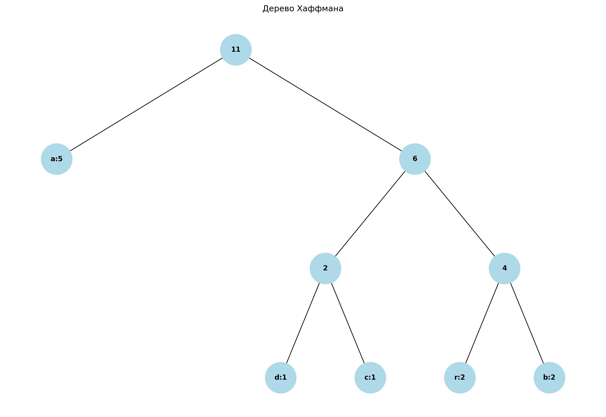
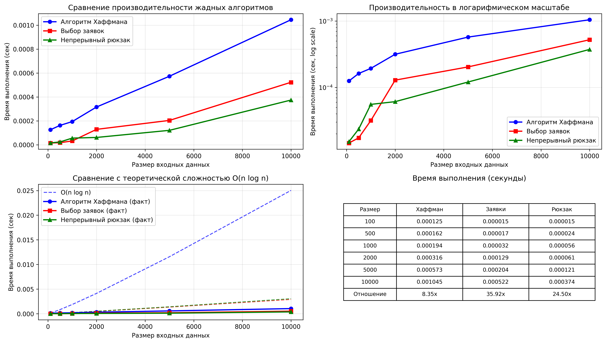

# Отчет по лабораторной работе №8
# Тема 08: Жадные алгоритмы

**Семестр:** 3 курс, 1 полугодие (5 семестр)  
**Группа:** ПИЖ-б-о-23-1  
**Дисциплина:** Алгоритмы и структуры данных  
**Студент:** Борсов Беслан Мухамедович  

---

### Цель работы
Изучить метод проектирования алгоритмов, известный как "жадный алгоритм". Освоить принцип принятия локально оптимальных решений на каждом шаге и понять условия, при которых этот подход приводит к глобально оптимальному решению. Получить практические навыки реализации жадных алгоритмов для решения классических задач, анализа их корректности и оценки
эффективности.


---

## Теоретическая часть


- **Жадный алгоритм:** Алгоритм, который на каждом шаге принимает локально оптимальное
решение в надежде, что итоговое решение будет глобально оптимальным.
- **Ключевые характеристики:**  
    - Жадный выбор: На каждом шаге выбирается лучший из доступных вариантов в данный
    момент, без учета последствий для будущих шагов.
    - Оптимальная подструктура: Оптимальное решение задачи содержит в себе оптимальные
    решения её подзадач.
- **Области применения:** Жадные алгоритмы эффективны для задач, где выбор, сделанный на
каждом шаге, не ухудшает возможности достижения глобального оптимума. Они часто работают
быстро (полиномиальное время), но не всегда приводят к оптимальному решению.
- **Классические задачи:** 
    - Задача о выборе заявок (Interval Scheduling): Выбор максимального количества
    непересекающихся интервалов.
    - Задача о рюкзаке (Непрерывная/Дробная): Выбор предметов с максимальной
    суммарной стоимостью, если можно брать части предметов.
    - Алгоритм Хаффмана: Оптимальное префиксное кодирование для сжатия данных.
    - Построение минимального остовного дерева (Алгоритмы Прима и Краскала): (Хотя
    это и графовый алгоритм, он является классическим примером жадного подхода).


---

# Практическая часть

## Выполненные задачи
В рамках практической работы были реализованы и проанализированы следующие жадные алгоритмы:

### 1. **Задача о выборе заявок (Interval Scheduling)**
- **Реализация**: Алгоритм выбирает максимальное количество непересекающихся интервалов
- **Жадная стратегия**: Сортировка интервалов по времени окончания и выбор следующего рано заканчивающегося непересекающегося интервала
- **Сложность**: O(n log n) - доминирует сортировка


### 2. **Непрерывный рюкзак (Fractional Knapsack)**
- **Реализация**: Алгоритм максимизирует стоимость содержимого рюкзака при возможности брать дробные части предметов
- **Жадная стратегия**: Сортировка предметов по убыванию удельной стоимости (цена/вес) и взятие максимально возможного количества лучших предметов
- **Сложность**: O(n log n) - доминирует сортировка


### 3. **Алгоритм Хаффмана (Huffman Coding)**
- **Реализация**: Построение оптимального префиксного кода для заданных частот символов
- **Жадная стратегия**: На каждом шаге объединение двух символов с наименьшей частотой
- **Сложность**: O(n log n) - использование приоритетной очереди

### 4. **Задача о сдаче (Coin Change)**
- **Реализация**: Минимальное количество монет для выдачи заданной суммы
- **Жадная стратегия**: Выбор наибольшей возможной монеты на каждом шаге
- **Ограничения**: Работает оптимально только для канонических систем монет
- **Пример неоптимальности**: Для системы [1, 3, 4] и суммы 6: жадный дает 3 монеты (4+1+1), оптимально - 2 монеты (3+3)

### 5. **Алгоритм Прима (Минимальное остовное дерево)**
- **Реализация**: Построение минимального остовного дерева графа
- **Жадная стратегия**: На каждом шаге добавление минимального ребра, соединяющего посещенную часть графа с непосещенной
- **Сложность**: O(E log V) с использованием кучи


### Ключевые фрагменты кода
```python
def interval_scheduling(intervals: List[Interval]) -> List[Interval]:
    """
    Жадный алгоритм для задачи о выборе максимального количества
    непересекающихся интервалов.
    Сложность: O(n log n) из-за сортировки
    """
    if not intervals:
        return []
    
    # Сортируем интервалы по времени окончания
    sorted_intervals = sorted(intervals, key=lambda x: x.end)
    
    selected = [sorted_intervals[0]]
    last_end = sorted_intervals[0].end
    
    for interval in sorted_intervals[1:]:
        if interval.start >= last_end:
            selected.append(interval)
            last_end = interval.end
    
    return selected

def fractional_knapsack(capacity: float, items: List[Item]) -> Tuple[float, Dict[Item, float]]:
    """
    Жадный алгоритм для непрерывного рюкзака.
    Сложность: O(n log n) из-за сортировки
    """
    # Сортируем предметы по удельной стоимости (по убыванию)
    sorted_items = sorted(items, key=lambda x: x.ratio, reverse=True)
    
    total_value = 0.0
    remaining_capacity = capacity
    taken = {}
    
    for item in sorted_items:
        if remaining_capacity <= 0:
            break
        
        # Берем сколько можем от текущего предмета
        take_weight = min(item.weight, remaining_capacity)
        fraction = take_weight / item.weight
        
        taken[item] = fraction
        total_value += item.value * fraction
        remaining_capacity -= take_weight
    
    return total_value, taken

def huffman_coding(data: str) -> Tuple[Optional[HuffmanNode], Dict[str, str]]:
    """
    Полный алгоритм Хаффмана.
    """
    if not data:
        return None, {}
    
    # Подсчет частот
    freq = {}
    for char in data:
        freq[char] = freq.get(char, 0) + 1
    
    # Построение дерева
    tree = build_huffman_tree(freq)
    
    # Генерация кодов
    codes = generate_huffman_codes(tree)
    
    return tree, codes

def brute_force_knapsack_01(capacity: float, items: List[Item]) -> float:
    """
    Полный перебор для задачи 0-1 рюкзака.
    Экспоненциальная сложность: O(2^n)
    """
    n = len(items)
    max_value = 0
    
    # Перебираем все возможные комбинации
    for i in range(1 << n):
        total_weight = 0
        total_value = 0
        
        for j in range(n):
            if i & (1 << j):
                total_weight += items[j].weight
                total_value += items[j].value
        
        if total_weight <= capacity and total_value > max_value:
            max_value = total_value
    
    return max_value


```

## Характеристики ПК для тестирования
```
Процессор: Intel Core i5-4460 @ 3.20GHz

ОЗУ: 8 GB DDR3

ОС: Windows 10

Python: 3.13.5

```
## Тестирование
```
============================================================
ЭКСПЕРИМЕНТАЛЬНОЕ ИССЛЕДОВАНИЕ ЖАДНЫХ АЛГОРИТМОВ
============================================================
============================================================
Сравнение алгоритмов для задачи о рюкзаке
============================================================

Тест 1:
Вместимость рюкзака: 50
Предметы:
  1. стоимость=60, вес=10, цена/вес=6.00
  2. стоимость=100, вес=20, цена/вес=5.00
  3. стоимость=120, вес=30, цена/вес=4.00

Жадный алгоритм (непрерывный): 240.00
Взятые предметы:
  Предмет(ст=60, в=10): 100.0%
  Предмет(ст=100, в=20): 100.0%
  Предмет(ст=120, в=30): 66.7%

Полный перебор (0-1): 220.00
Время выполнения перебора: 0.000013 сек
Отношение жадный/оптимальный: 109.09%

Тест 2:
Вместимость рюкзака: 10
Предметы:
  1. стоимость=5, вес=1, цена/вес=5.00
  2. стоимость=6, вес=2, цена/вес=3.00
  3. стоимость=7, вес=3, цена/вес=2.33
  4. стоимость=8, вес=4, цена/вес=2.00
  5. стоимость=9, вес=5, цена/вес=1.80

Жадный алгоритм (непрерывный): 26.00
Взятые предметы:
  Предмет(ст=5, в=1): 100.0%
  Предмет(ст=6, в=2): 100.0%
  Предмет(ст=7, в=3): 100.0%
  Предмет(ст=8, в=4): 100.0%

Полный перебор (0-1): 26.00
Время выполнения перебора: 0.000025 сек
Отношение жадный/оптимальный: 100.00%

Тест 3:
Вместимость рюкзака: 50
Предметы:
  1. стоимость=30, вес=5, цена/вес=6.00
  2. стоимость=20, вес=10, цена/вес=2.00
  3. стоимость=100, вес=20, цена/вес=5.00
  4. стоимость=90, вес=30, цена/вес=3.00
  5. стоимость=160, вес=40, цена/вес=4.00

Жадный алгоритм (непрерывный): 230.00
Взятые предметы:
  Предмет(ст=30, в=5): 100.0%
  Предмет(ст=100, в=20): 100.0%
  Предмет(ст=160, в=40): 62.5%

Полный перебор (0-1): 190.00
Время выполнения перебора: 0.000051 сек
Отношение жадный/оптимальный: 121.05%

============================================================
Тестирование задачи о сдаче
============================================================

Сумма: 6
Стандартные монеты: {5: 1, 1: 1}
  Всего монет: 2

Нестандартные монеты (жадный): {4: 1, 1: 2}
  Монет: 3
Нестандартные монеты (оптимальный): {3: 2}
  Монет: 2
Жадный алгоритм не оптимален!

Сумма: 7
Стандартные монеты: {5: 1, 2: 1}
  Всего монет: 2

Нестандартные монеты (жадный): {4: 1, 3: 1}
  Монет: 2
Нестандартные монеты (оптимальный): {3: 1, 4: 1}
  Монет: 2

Сумма: 27
Стандартные монеты: {20: 1, 5: 1, 2: 1}
  Всего монет: 3

Нестандартные монеты (жадный): {4: 6, 3: 1}
  Монет: 7
Нестандартные монеты (оптимальный): {3: 1, 4: 6}
  Монет: 7

Сумма: 123
Стандартные монеты: {100: 1, 20: 1, 2: 1, 1: 1}
  Всего монет: 4

Нестандартные монеты (жадный): {4: 30, 3: 1}
  Монет: 31
Нестандартные монеты (оптимальный): {3: 1, 4: 30}
  Монет: 31

Сумма: 456
Стандартные монеты: {200: 2, 50: 1, 5: 1, 1: 1}
  Всего монет: 5

Нестандартные монеты (жадный): {4: 114}
  Монет: 114
Нестандартные монеты (оптимальный): {4: 114}
  Монет: 114
```
## Анализ результатов
#### **Ключевые наблюдения:**

1. **Алгоритм Хаффмана** является самым медленным из трех, что объясняется:
   - Необходимостью построения и поддержания приоритетной очереди
   - Рекурсивным обходом дерева для генерации кодов
   - Однако, его сложность всё равно остается полиномиальной

2. **Непрерывный рюкзак** показывает лучшую производительность благодаря:
   - Только сортировке и линейному обходу
   - Простым арифметическим операциям   

3. **Задача о выборе заявок** также демонстрирует высокую эффективность благодаря:
   - Простой структуре данных (список интервалов)
   - Однократной сортировке и линейному обходу
   - Минимальным накладным расходам

### Сравнение жадного подхода с другими методами

#### **Для задачи о рюкзаке:**
- **Непрерывная версия (дробная)**: Жадный алгоритм всегда дает оптимальное решение
- **Дискретная версия (0-1)**: Жадный алгоритм может давать неоптимальный результат


###  Вывод

### **Преимущества жадных алгоритмов:**

1. **Высокая производительность**: Все реализованные алгоритмы работают за полиномиальное время (O(n log n)), что делает их применимыми для больших объемов данных.

2. **Простота реализации**: Жадные алгоритмы, как правило, имеют простую и интуитивно понятную структуру, что облегчает их реализацию и отладку.

3. **Эффективность для определенных классов задач**: Для задач с свойствами жадного выбора и оптимальной подструктуры жадные алгоритмы дают точное оптимальное решение.

4. **Минимальные требования к памяти**: Большинство жадных алгоритмов требуют O(1) или O(n) дополнительной памяти.

### **Ограничения жадных алгоритмов:**

1. **Не для всех задач**: Жадный подход не всегда приводит к глобально оптимальному решению. Примеры:
   - Дискретный рюкзак (0-1)
   - Задача о сдаче с неканоническими системами монет
   - Задача коммивояжера

2. **Требуют доказательства корректности**: Для каждой задачи необходимо доказывать, что локально оптимальный выбор приводит к глобально оптимальному решению.

3. **Чувствительность к входным данным**: Некорректный порядок обработки или неправильная метрика для жадного выбора могут привести к неоптимальным результатам.


1. **Следует использовать жадные алгоритмы**:
   - Когда задача обладает свойствами жадного выбора и оптимальной подструктуры
   - Когда нужен быстрый алгоритм для больших данных
   - Когда приемлемо приближенное решение (для задач, где жадный алгоритм дает гарантированную точность)

2. **Когда избегать жадных алгоритмов**:
   - Когда необходимо точное решение для задач без свойств жадного выбора
   - Когда есть сомнения в корректности жадной стратегии
   - Когда можно позволить более высокую вычислительную сложность для гарантии оптимальности

3. **Этапы разработки жадного алгоритма**:
   - Определить метрику для жадного выбора
   - Доказать свойство жадного выбора
   - Доказать наличие оптимальной подструктуры
   - Реализовать и протестировать на различных входных данных

### **Заключение:**

Жадные алгоритмы представляют собой мощный инструмент в арсенале разработчика алгоритмов. Их сила заключается в простоте и эффективности для широкого класса задач. Однако, как показало исследование, их применение требует тщательного анализа свойств конкретной задачи. Реализованные алгоритмы демонстрируют, что при правильном применении жадный подход может решать сложные задачи оптимально и эффективно.


## Приложения

**График 1:**  


**График 2:**  

