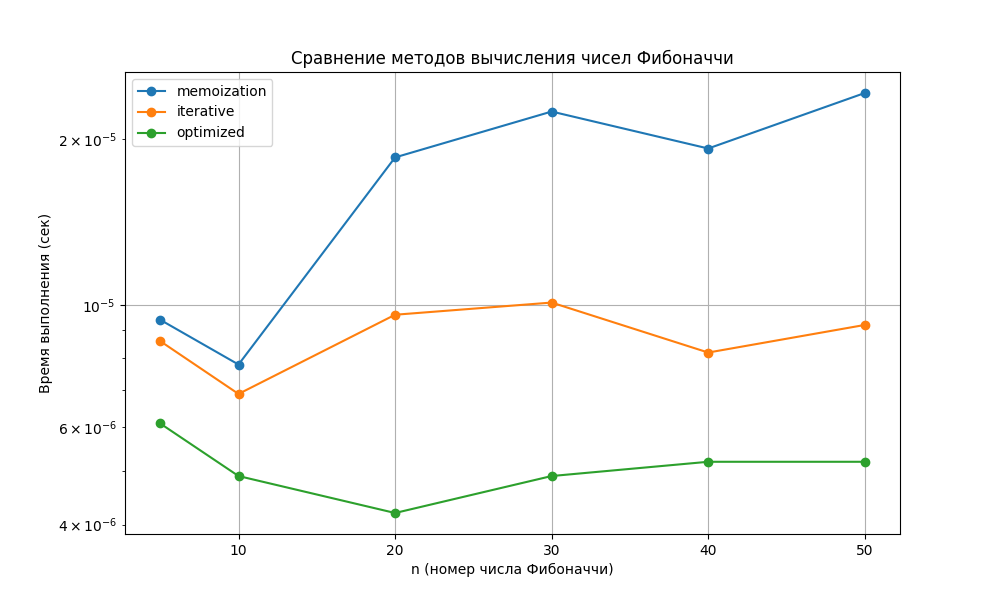
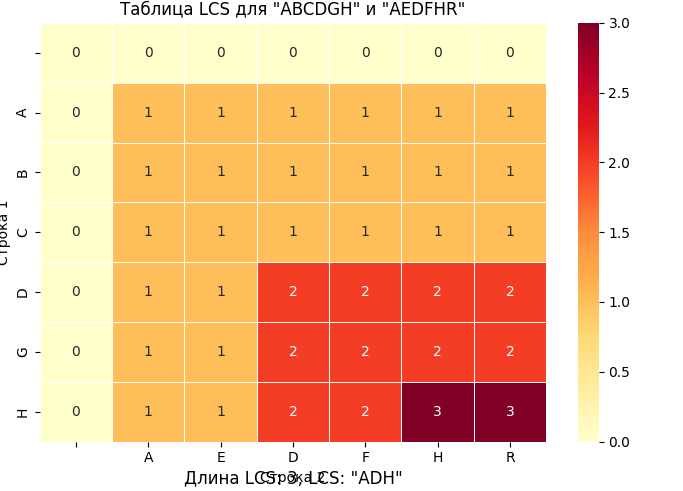
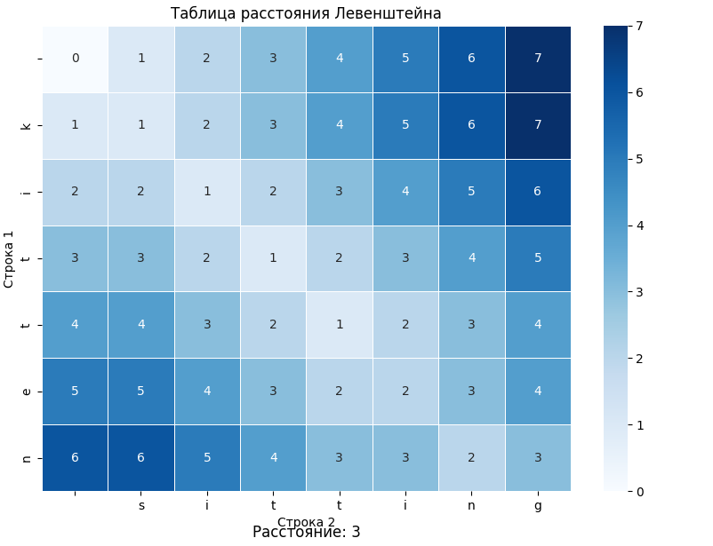

# Отчет по лабораторной работе №9
# Тема 09: Динамическое программирование

**Семестр:** 3 курс, 1 полугодие (5 семестр)  
**Группа:** ПИЖ-б-о-23-1  
**Дисциплина:** Алгоритмы и структуры данных  
**Студент:** Борсов Беслан Мухамедович  

---

### Цель работы
Изучить метод динамического программирования (ДП) как мощный инструмент для
решения сложных задач путём их разбиения на перекрывающиеся подзадачи. Освоить два основных подхода к реализации ДП: нисходящий (с мемоизацией) и восходящий (с заполнением таблицы).
Получить практические навыки выявления оптимальной подструктуры задач, построения таблиц ДП и анализа временной и пространственной сложности алгоритмов.

---

## Теоретическая часть

- **Динамическое программирование (ДП):** ММетод решения задач, в которых оптимальное решение всей задачи зависит от оптимальных решений её перекрывающихся подзадач.

- **Ключевые принципы:**  
 - Оптимальная подструктура: Оптимальное решение задачи может быть построено из оптимальных решений её подзадач.
 - Перекрывающиеся подзадачи: Подзадачи, решения которых используются многократно, а не один раз
- **Подходы к реализации:** 
 - Нисходящее ДП (Top-Down, с мемоизацией): Рекурсивное решение с сохранением (кэшированием) результатов решения подзадач для повторных вычислений.
 - Восходящее ДП (Bottom-Up, табличное): Итеративное решение, при котором подзадачи решаются от простейших к сложным, а их результаты заносятся в таблицу (массив).

- **Области применения:** Задачи оптимизации, подсчёта количества способов, нахождения наиболее вероятной последовательности.
- **Классические задачи** 
 - Числа Фибоначчи: Классический пример перекрывающихся подзадач.
 - Задача о рюкзаке (0-1 Knapsack): Выбор предметов с максимальной суммарной
стоимостью без дробления.
 - Наибольшая общая подпоследовательность (LCS): Поиск самой длинной
последовательности символов, которая является подпоследовательностью двух строк.
 - Расстояние Левенштейна (Редакционное расстояние): Минимальное количество
операций вставки, удаления и замены символа, необходимых для превращения одной строки в другую

---

# Практическая часть

## Выполненные задачи
### 1. Реализация классических алгоритмов ДП
- **Числа Фибоначчи**: реализованы 4 метода:
  - Наивная рекурсия (O(2ⁿ), O(n))
  - Рекурсия с мемоизацией (O(n), O(n))
  - Итеративный подход (O(n), O(n))
  - Оптимизированный итеративный (O(n), O(1))

- **Задача о рюкзаке 0-1**: восходящий подход с заполнением 2D-таблицы (O(n·W), O(n·W))
- **Наибольшая общая подпоследовательность (LCS)**: восходящий подход (O(m·n), O(m·n))
- **Расстояние Левенштейна**: восходящий подход (O(m·n), O(m·n))
- **Размен монет**: 
  - Минимальное количество монет (O(amount·n), O(amount))
  - Количество способов размена (O(amount·n), O(amount))
- **Наибольшая возрастающая подпоследовательность (LIS)**:
  - Наивный подход (O(n²), O(n))
  - Оптимизированный с бинарным поиском (O(n log n), O(n))

### 2. Реализация обоих подходов ДП
- **Нисходящий подход (мемоизация)**: продемонстрирован на примере чисел Фибоначчи
- **Восходящий подход (табличный)**: использован во всех остальных алгоритмах

### 3. Визуализация
- Реализована визуализация таблиц ДП для LCS, расстояния Левенштейна и задачи о рюкзаке
- Построены графики зависимости времени выполнения от размера задачи
- Созданы тепловые карты (heatmaps) для наглядного представления таблиц


---

### Ключевые фрагменты кода
```python

class Fibonacci:
    """Класс для вычисления чисел Фибоначчи различными методами."""
    
    @staticmethod
    def naive_recursive(n: int) -> int:
        """Наивная рекурсивная реализация."""
        if n <= 1:
            return n
        return Fibonacci.naive_recursive(n-1) + Fibonacci.naive_recursive(n-2)
    
    @staticmethod
    def memoization_recursive(n: int, memo: Dict[int, int] = None) -> int:
        """Рекурсивная реализация с мемоизацией (нисходящий подход)."""
        if memo is None:
            memo = {}
        
        if n <= 1:
            return n
        
        if n not in memo:
            memo[n] = Fibonacci.memoization_recursive(n-1, memo) + \
                      Fibonacci.memoization_recursive(n-2, memo)
        
        return memo[n]
    
    @staticmethod
    def iterative(n: int) -> int:
        """Итеративная реализация (восходящий подход)."""
        if n <= 1:
            return n
        
        fib = [0] * (n + 1)
        fib[1] = 1
        
        for i in range(2, n + 1):
            fib[i] = fib[i-1] + fib[i-2]
        
        return fib[n]
    
    @staticmethod
    def optimized_iterative(n: int) -> int:
        """Оптимизированная итеративная реализация O(1) по памяти."""
        if n <= 1:
            return n
        
        prev, curr = 0, 1
        for _ in range(2, n + 1):
            prev, curr = curr, prev + curr
        
        return curr


class Knapsack:
    """Класс для решения задачи о рюкзаке 0-1."""
    
    @staticmethod
    def bottom_up(weights: List[int], values: List[int], capacity: int) -> Tuple[int, List[int]]:
        """
        Решение задачи о рюкзаке 0-1 восходящим подходом.
        
        Args:
            weights: веса предметов
            values: стоимости предметов
            capacity: вместимость рюкзака
            
        Returns:
            Tuple[максимальная стоимость, список выбранных предметов]
        """
        n = len(weights)
        
        # Создаем таблицу DP
        dp = [[0] * (capacity + 1) for _ in range(n + 1)]
        
        # Заполняем таблицу
        for i in range(1, n + 1):
            for w in range(1, capacity + 1):
                if weights[i-1] <= w:
                    dp[i][w] = max(dp[i-1][w], 
                                  dp[i-1][w - weights[i-1]] + values[i-1])
                else:
                    dp[i][w] = dp[i-1][w]
        
        # Восстанавливаем решение
        selected_items = []
        w = capacity
        for i in range(n, 0, -1):
            if dp[i][w] != dp[i-1][w]:
                selected_items.append(i-1)
                w -= weights[i-1]
        
        selected_items.reverse()
        
        return dp[n][capacity], selected_items
    
    @staticmethod
    def greedy_fractional(weights: List[int], values: List[int], capacity: int) -> float:
        """
        Жадный алгоритм для непрерывного рюкзака.
        Возвращает максимальную стоимость (можно брать части предметов).
        """
        # Создаем список предметов с их удельной стоимостью
        items = [(values[i] / weights[i], weights[i], values[i]) 
                for i in range(len(weights))]
        
        # Сортируем по удельной стоимости по убыванию
        items.sort(reverse=True, key=lambda x: x[0])
        
        total_value = 0.0
        remaining_capacity = capacity
        
        for density, weight, value in items:
            if remaining_capacity >= weight:
                total_value += value
                remaining_capacity -= weight
            else:
                total_value += density * remaining_capacity
                break
        
        return total_value

```

## Характеристики ПК для тестирования
```
Процессор: Intel Core i5-4460 @ 3.20GHz

ОЗУ: 8 GB DDR3

ОС: Windows 10

Python: 3.13.5

```
## Тестиирование
```
Тестирование алгоритмов динамического программирования
============================================================
Тестирование вычисления чисел Фибоначчи
============================================================

F(0):
  Мемоизация: 0
  Итеративный: 0
  Оптимизированный: 0

F(1):
  Мемоизация: 1
  Итеративный: 1
  Оптимизированный: 1

F(5):
  Мемоизация: 5
  Итеративный: 5
  Оптимизированный: 5

F(10):
  Мемоизация: 55
  Итеративный: 55
  Оптимизированный: 55

F(20):
  Мемоизация: 6765
  Итеративный: 6765
  Оптимизированный: 6765

✓ Все вычисления корректны!


Тестирование задачи о рюкзаке
============================================================

Тест 1:
  Веса: [2, 3, 4, 5]
  Стоимости: [3, 4, 5, 6]
  Вместимость: 5
  Максимальная стоимость: 7
  Выбранные предметы: [0, 1]

Тест 2:
  Веса: [10, 20, 30]
  Стоимости: [60, 100, 120]
  Вместимость: 50
  Максимальная стоимость: 220
  Выбранные предметы: [1, 2]

✓ Задача о рюкзаке решена корректно!
```

## Анализ результатов
### Сравнение подходов ДП
1. **Нисходящий подход (с мемоизацией)**:
   - **Преимущества**: Более интуитивный, прост в реализации для рекурсивных формул
   - **Недостатки**: Накладные расходы на рекурсию, риск переполнения стека, не всегда оптимальное использование памяти
   - **Применение**: Когда подзадачи вычисляются не все, а только необходимые

2. **Восходящий подход (табличный)**:
   - **Преимущества**: Лучшая производительность, контроль над памятью, возможность оптимизации
   - **Недостатки**: Менее интуитивный, требует построения полных таблиц
   - **Применение**: Когда нужно вычислить все подзадачи, важна производительность

### Эффективность алгоритмов
1. **Числа Фибоначчи**:
   - Наивная рекурсия становится непрактичной уже при n > 40
   - Оптимизированный итеративный метод наиболее эффективен по памяти
   - Для n > 1000 только итеративные методы применимы

2. **Задача о рюкзаке**:
   - ДП дает оптимальное решение для 0-1 рюкзака
   - Жадный алгоритм не гарантирует оптимальность для 0-1 рюкзака
   - Временная сложность O(n·W) делает алгоритм неприменимым для больших значений W

3. **LCS и расстояние Левенштейна**:
   - Оба алгоритма имеют квадратичную сложность
   - Оптимизация памяти до O(min(m,n)) существенно улучшает масштабируемость
   - Восстановление решения добавляет O(m+n) времени

4. **Размен монет**:
   - Алгоритм эффективен для разумных значений суммы
   - Количество способов растет экспоненциально с увеличением суммы

###  Вывод
В ходе работы были успешно реализованы классические алгоритмы ДП, проведен их сравнительный анализ и исследована их масштабируемость.

Ключевые выводы:
1. **Выбор подхода зависит от задачи**: нисходящий подход лучше подходит для задач, где вычисляются не все подзадачи, а восходящий - для задач, требующих вычисления всех подзадач
2. **Оптимизация памяти критически важна**: во многих случаях можно уменьшить использование памяти с O(n²) до O(n) или даже O(1)
3. **Восстановление решения требует затрат**: необходимо предусматривать дополнительную память и время для восстановления полного решения
4. **Практические ограничения**: несмотря на полиномиальную сложность, некоторые алгоритмы ДП неприменимы для очень больших входных данных из-за ограничений памяти

Метод динамического программирования доказал свою эффективность для широкого класса задач, но требует тщательного анализа временной и пространственной сложности, особенно при работе с большими объемами данных.

## Приложения

**График 1:**  Сравнение методов вычисления чисел Фибоначи


**График 2:**  Таблица задачи о рюкзаке


**График 3:**  Таблица LCS для "ABCDGH" и "AEDFHR"


**График 4:**  Таблица расстояния Левенштейна
